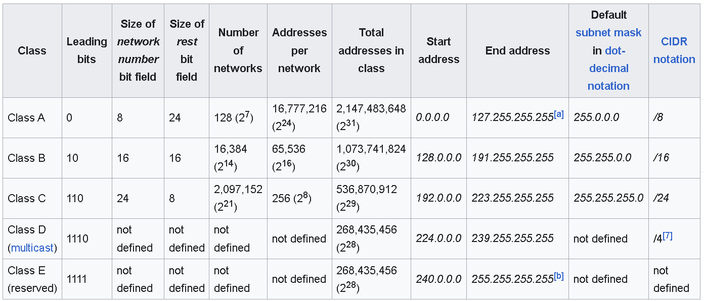

### DAY1: 17 nov 2023

## NETWORKING

1. IP adress ipv4 and ipv6
2. Subnetting
3. NAT
4. Gateway
5. VPN
6. Wide Area Network
7. DNS

- Basics:
  - Network interfaces connect to the network and ip adress is allocated
  - Ti check ip from command line `ipconfig`
- IP adress is used to uniquely identify a device across network
- IP adress = Network id + Host id
  - When we execute ipconfig we get:
    1. ip adress
    2. subnet mask
    3. default gaateway
- ipv4 adress is a 32 bit number broken down in to 4 octects
- x.x.x.x => 0.0.0.0 to 255.255.255.255

References:

https://www.mymathtables.com/numbers/power-exponentiation/power-of-2.html (2 power table)

https://www.rapidtables.com/convert/number/binary-to-decimal.html (binary to decimal converter)

- Two devices can communicate directly if they are in same network
- If they have same network id then they belong to same network
- Finding network and host id:

- Example 1:

  - ip : 192.168.100.198
    sm : 255.255.255.0

    - Octects with 255 => 1,2 and 3

      - Network id: 192.168.100
      - `The fixed octects are known as Network id`

    - Octects with 0 => 1
      - Host id: 198
      - `The octects with 0 are known as Host id`

- Example 2:

  - ip : 192.168.100.198
  - sm : 255.255.0.0

    - Octects with 255 => 2
      - Network id : 192.168
    - Octects with 0 => 2
      - Host id : 100.198

- Example 3:

  - ip : 10.168.100.198
  - sm : 255.0.0.0
    - Network id => 10
    - Host id => 168.100.198

- My pc:

  - ip: 192.168.228.234
  - sm: 255.255.255.0
    - Network id: 198.168.228
    - Host id: 234

- Router is networking component which has rules (route table) which forwards packets from one network to other
- Default Gate way represents router

- When a device want to communicate with other device it generates packet
- Packet is the small network component which carries information such as:
  - Source
  - Destination
  - Data
  - Protocol
- Just before communication/sending the packet it will try to decide fastest route and it will come back in the same direction
- When we try to send packets to a different network, packets are forwarded to router.
- Router identifies this is not same network, by hopping the packets jumps from one network to other till the destination

`router`: router is a networking component which forwards packets from one network to other

- This is Default Gateway (ip of router)
- There are some rules in the router is known as route table

Exercise:

- Draw a network diagram representing your home internet connection
- Binary and Decimal numbers
- Hopping
- router and switch
- TORS (Top of the rack switch)
  ----> tracert <website name>

Next: Subnetting

### DAY2: 18 nov 2023

Contd...

## NETWORK SIZE

- Example:

  - ip: 192.168.0.11
  - sm: 255.255.255.0
  - nid: 192.168.0
  - hid: 11

- All the devices in the network will have same network id is fixed
- Network size => 2 ^ (no of host id bits) - 2
- hid = 1 octect
- network size = 2 ^ 8 - 2 => 256 - 2 => 254
- In the above 2 represents
  - Zero (192.168.0.0) : network id
  - 255 (192.168.0.255) => broadcast address
- To design Network we have two approaches:

  - Classful Networking <not useful>

  

* classless interdomain routing (CIDR)
* Figure out number of bits for host id and for network id

* Example 1: a network of 200 devices

  - Basic formula 2^n -2 = <number of devices>

  * 2^n - 2 ~= 200
  * n = 8 ( number of zeros)
  * N = 32 - 8 = 24
  * SM: 11111111.11111111.11111111.00000000
  * 255.255.255.0

* Exercise:
* A network of 500 devices
* A network of 25000 devices
  - 2^n - 2 = 25000
  - 2^15 - 2 = 25000
  - N = 32 - 15 = 17
  - SM: 11111111.11111111.10000000.00000000
    255.255.128.0
* A network of size 32 devics

  - 2^n -2 = 32
  - n = 5
  - N = 32 - 5 => 27
  - 11111111.11111111.11111111.11000000
    255.255.255.192

* A network of size 200000 devices

  - 2^n -2 = 200000
  - n = 18
  - N = 32 - 18 => 14
  - 11111111.11111100.00000000.00000000
  - 255.2520.0

* Public network: This is accessible from internet
* private network: This is private network meant for internal use. For this there are reserved ip ranges
  

* CIDR Notation: Classless Inter Domain Routing <used these days>
* The CIDR notation is represented as x.x.x.x/N where N = number of 1's i.e. network id
* Expand CIDR:

  192.168.0.0/24

ip: 192. 168. 0. 0
range: 192. 168. 0.xxxxxxxx
start: 192. 168. 0.00000000 => 192.168.0.0
end: 192. 168. 0.11111111 => 192.168.0.255
sm: 11111111.11111111.11111111.00000000

ip: 192.168.130.0/23
sm: 11111111.11111111.11111110.00000000
range: 192. 168.1000001x.xxxxxxxx
start: 192. 168.10000010.00000000 => 192.168.130.0
end: 192. 168.10000011.11111111 => 192.168.131.255

ip: 10.100.100.128/26

          10.      100.     100.    128
sm:  11111111.11111111.11111111.11000000
range      10.     100      100.10xxxxxx
start      10.      100     100.10000000 => 10.100.100.128
end        10.      100     100.10111111 => 10.100.100.191

`sm 0's = x`

- Exercise:

1. 172.16.0.0/22
        
2. 10.128.0.0/13

Note: If we want to send some message to all the devices in network we can send it to broadcast adress, it will forward to all the devices with in the network
